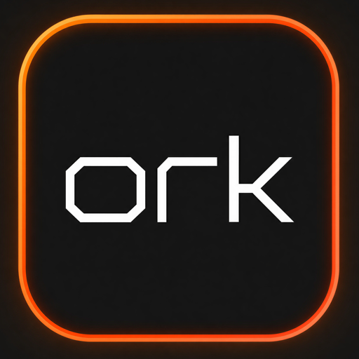

<div align="center">



**A native macOS deck for orchestrating AI coding agents.**

Claude Code, Codex, OpenCode, Gemini CLI: every agent in its own terminal,
every terminal in its own git worktree, all in one window.

[](https://swift.org)
[](#install)
[](LICENSE)
[](https://github.com/rodrigooler/ork/releases)

</div>

## Why

Terminal agents multiplied, and running four of them across ad hoc terminal tabs, each one fighting the others for the same working tree, is chaos. ork gives each agent its own terminal and its own git worktree, organized per project, in a single native window. Pure Swift and SwiftUI, no Electron.

## Features

- **Workspaces and organizations**: register project folders and group them by company or context; each workspace runs its own agent fleet.
- **Agent sessions**: spawn Claude Code, Codex, OpenCode, Gemini CLI or a plain shell in one click.
- **Worktree isolation**: each session runs on its own branch in a dedicated worktree, created with plain `git worktree add`.
- **Terminal grid and focus mode**: all sessions side by side; isolate one terminal over a dimmed backdrop, live PTY intact.
- **Flow view**: workspace and agents as a connected topology; click a node to focus its terminal.
- **Session persistence**: open sessions survive a relaunch, reattach to the same worktree and resume the agent conversation where the CLI supports it.
- **Idle freeze**: a session idling for ten minutes is suspended with SIGSTOP and stops burning CPU; any interaction wakes it.
- **Data pane per project**: register the Postgres and Redis each project talks to, with a live reachability probe.
- **Usage dashboard**: token usage from your Claude Code transcripts, 14 day chart.
- **Menu bar companion and notch glance**: running agents, today's tokens and exit notifications in the menu bar; hover the MacBook notch for a quick panel.

## Install

Grab the latest zip from [Releases](https://github.com/rodrigooler/ork/releases), unpack it and run `./Ork` from the unpacked folder. Requires macOS 14 or newer on Apple Silicon. Releases are not notarized yet, so clear the quarantine flag once:

```sh
xattr -dr com.apple.quarantine <unpacked-folder>
```

### Build from source

Requirements: macOS 14+, Xcode 15+ (any recent Swift toolchain).

```sh
git clone https://github.com/rodrigooler/ork.git
cd ork
swift run
```

Or open `Package.swift` in Xcode and hit Run.

Sessions run inside a zsh login shell, so any agent CLI on your shell profile `PATH` (`claude`, `codex`, `opencode`, ...) resolves without configuration.

## Built-in agents

| Agent | Command | Accent |
|-------|---------|--------|
| Claude Code | `claude` | coral |
| Codex | `codex` | green |
| OpenCode | `opencode` | cyan |
| Gemini CLI | `gemini` | blue |
| Shell | `zsh` | amber |

Adding an agent is a one line change in `Sources/Ork/Models.swift` for now. Config file driven agents are on the roadmap.

## How worktree isolation works

When you spawn a session with the worktree switch on, ork runs:

```sh
git -C <workspace> worktree add -b ork/<agent>-<id> <parent>/.ork-worktrees/<repo>/<agent>-<id>
```

The agent starts inside that fresh worktree, on its own branch, so two agents never fight over the same files. Closing a session keeps the worktree on disk (no work is ever lost); prune with `git worktree prune` when you are done.

## Architecture

```
Sources/Ork/
├── OrkApp.swift            entry point, window chrome, font registration
├── Theme.swift             design tokens, motion voice, backdrop, panel styles
├── Models.swift            AgentProfile, Workspace, TerminalSession, DBConnection
├── AppStore.swift          app state + JSON persistence (Application Support)
├── WorktreeService.swift   git worktree plumbing
├── TerminalRegistry.swift  PTY lifecycle, focus tracking, terminal font stack
├── FreezeService.swift     SIGSTOP/SIGCONT for idle sessions
├── NotchPanel.swift        notch glance panel (borderless NSPanel)
├── UsageService.swift      token usage from Claude Code transcripts
├── Notifier.swift          exit notifications (osascript)
├── Reachability.swift      TCP probe for data endpoints
├── Logo.swift              brand mark, Dock icon, bundled Orbitron face
└── Views/                  SwiftUI: sidebar, grid, flow topology, data pane, usage, menu bar panel
```

One external dependency: [SwiftTerm](https://github.com/migueldeicaza/SwiftTerm) for terminal emulation.

Design decisions and trade-offs live in [docs/DESIGN.md](docs/DESIGN.md).

## Roadmap

The plan lives in [ROADMAP.md](ROADMAP.md). Next up: query consoles for Postgres and Redis, config file driven agents, and a worktree janitor.

## Inspiration

[paperclip.ing](https://paperclip.ing), [The Maestri](https://www.themaestri.app), [AgentPeek](https://agentpeek.app) and the whole wave of agent-native tooling.

## License

[MIT](LICENSE)
